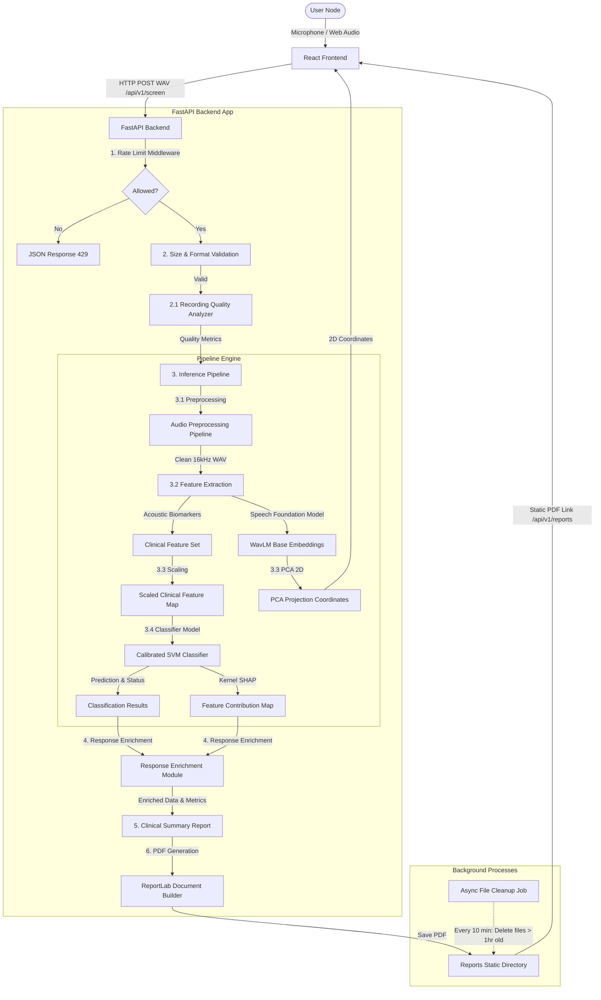

# VitaVoice System Architecture

This document outlines the technical architecture, data processing pipelines, and system layout of the **VitaVoice AI-Powered Vocal Biomarker Screening Platform**.

---

## 1. System Overview

VitaVoice is split into an enterprise-grade **FastAPI Backend** and a modern **React SPA Frontend (Vite + TypeScript)**. 

### Core System Architecture

---

## 2. Audio Processing & Quality Pipeline

The backend implements a multi-stage pipeline utilizing `librosa`, `soundfile`, and `transformers` to isolate the voice signal, analyze quality, and extract clinical metrics:

### 2.1 Pre-Inference Recording Quality Analysis
Before passing raw audio to the machine learning model, a dedicated **Recording Quality Analyzer** runs to check signal integrity:
- **Background Noise & SNR Estimation**: Computes RMS energy of audio frames using 25ms windows with 10ms hops. Identifies noise floors and computes the Signal-to-Noise Ratio (SNR) in dB.
- **Speech Coverage & Silence Ratio**: Uses adaptive thresholding based on the noise floor to distinguish speech from silent frames, calculating speech coverage and silence ratios.
- **Clipping Detection**: Checks if the audio waveform reaches digital saturation limits (amplitude $\ge 0.99$), warning if microphone clipping occurs.
- **Microphone Status & Suitability**: Labels the input signal quality (e.g., "Good", "Noisy", "Clipping Detected", "No Signal") and assigns a 1-5 star score. Screenings with scores $\le 2$ display warning notices about potential reliability issues.

### 2.2 Audio Preprocessing
1. **Downsampling & Resampling**: Forces raw input audio to mono channel at `16,000 Hz` (the standard sample rate for deep neural speech models).
2. **Spectral Gating Noise Reduction**: Estimates background noise profile and gates low-amplitude noise frequencies to isolate pure vocal cord signals.
3. **Longest-Run VAD Segmenter**: Detects voiced frames using energy and spectral flatness thresholds, then extracts the longest continuous voiced segment from the original waveform. This avoids phase discontinuities and frame overlap concatenation artifacts, keeping pitch stability metrics (Jitter/Shimmer) clean.
4. **Loudness Normalization**: Standardizes signal amplitude to a target peak of `-1.0 dBFS` to prevent microphone volume differences from biasing the classification.

---

## 3. Machine Learning & Feature Space Decoupling

To prevent Out-Of-Distribution (OOD) neural embeddings of real-world recordings from biasing the classification engine, the platform implements a decoupled machine learning architecture:

### Feature Space Definition
- **Clinical Acoustic Biomarkers**: Fundamental frequency ($F0$), local jitter (frequency stability), local shimmer (amplitude stability), Harmonics-to-Noise Ratio (HNR), Noise-to-Harmonics Ratio (NHR), Formants ($F1$-$F3$), RMS energy, MFCCs ($1$-$13$), Zero-Crossing Rate, and Chroma features ($1$-$12$). This yields a 22-dimensional clinical + nonlinear feature vector, further optimized to **10 selected features** using L1 regularization.
- **Deep Speech Representations**: A 768-dimensional contextual embedding extracted from the mean-pooled last hidden state of a pretrained **WavLM Base** model (`microsoft/wavlm-base`) used exclusively for visual clustering layout.

### Classification & Explainability
- **Clinical Feature Classification**: The 10 selected clinical features are scaled and fed into an optimized Calibrated SVM classifier to predict Parkinson's risk probability and status. Decoupling the neural WavLM embeddings from the classification model ensures high generalization to real-world voice inputs.
- **2D Embedding Visualization**: The WavLM Base neural embedding is projected to 2D coordinates using a pretrained PCA component for UI cluster mapping.
- **Explainable AI (SHAP)**: Computes Kernel SHAP/TreeSHAP values using the scaled 10-dimensional selected clinical feature space, mapping feature attributions of the top 5 biomarkers to the frontend dashboard.

---

## 4. Response Enrichment & Clinical Reports

Once the classification results and SHAP attributions are computed, a **Response Enrichment Module** compiles clinical annotations before serving the payload:
- **Certainty Calibration**: Translates raw risk margins into confidence labels ("Very High", "High", "Moderate", "Low") and prediction reliability ratings.
- **Top Biomarkers Extraction**: Automatically maps mathematical SHAP values to positive/negative directional indicators (e.g., $\uparrow$ Jitter, $\downarrow$ HNR) with human-readable clinical explanations.
- **Natural Language Explanations**: Generates a plain-English narrative summarizing the primary biomarkers driving the risk assessment.
- **Clinical Recommendations**: Stratifies actionable steps based on risk boundaries (e.g., quiet retesting for moderate risk; neurological consultations for high risk).
- **PDF Report Generation**: Invokes a custom ReportLab builder to output clean clinical summaries containing the quality analysis, UMAP projections, SHAP attributions, recommendations, and responsible AI points.

---

## 5. Clinical Copilot & Fallback Architecture

To support clinicians with deeper diagnostic context, the backend defines a modular **Clinical Copilot** sub-system via analysis router hooks (`/api/v1/analysis`):
- **Clinical Copilot Insights (`/api/v1/analysis/copilot-insight`)**: Processes voice recording IDs to serve LLM-ready context. The baseline fallback engine provides structured rule-based summaries derived from acoustic DSP measurements. The interface is pre-built to support future Retrieval-Augmented Generation (RAG) by integrating ChromaDB vector stores and external LLM APIs (e.g., OpenAI, Ollama).
- **Direct Report Access (`/api/v1/analysis/download-pdf/{prediction_id}`)**: Direct FileResponse stream for generating and downloading the compiled clinical ReportLab PDF document from server cache.

---

## 6. Frontend Component Architecture

The React frontend handles real-time audio visualization, environment calibration, and results dashboards:

- **Acoustic Calibration Node**: Samples ambient noise for 2 seconds to establish an RMS baseline before allowing recording.
- **Real-time Sinusoidal Wave Visualizer**: Renders overlapping sine waves using HTML5 Canvas API in a 60fps animation loop driven by the Web Audio API time-domain node.
- **Microphone Level Meter**: Displays live volume (dB) and turns red if digital clipping or saturation is imminent.
- **2D UMAP/PCA Projections**: Plots the user's vocal coordinate relative to healthy and pathological reference cohorts in a custom canvas chart supporting zoom and mouse hover tooltips.
- **Timeline Sidebar**: Loads and stores the user's last 10 screening records in `localStorage` for visual comparison over time.
- **Vocal Quality & Screening Insights**: Displays the enriched response data including quality star rating, clinical status benchmarks, SHAP directional items, and natural-language explanations.
