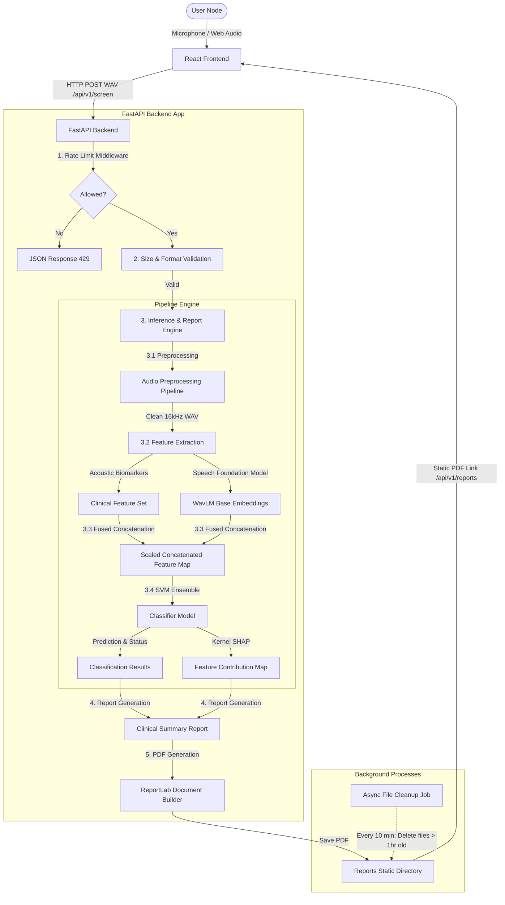

# VitaVoice System Architecture

This document outlines the technical architecture, data processing pipelines, and system layout of the **VitaVoice AI-Powered Vocal Biomarker Screening Platform**.

---

## 1. System Overview

VitaVoice is split into an enterprise-grade **FastAPI Backend** and a modern **React SPA Frontend (Vite + TypeScript)**. 

### Core System Architecture

---

## 2. Audio Processing Pipeline

The backend implements a multi-stage pipeline utilizing `librosa`, `soundfile`, and `transformers` to isolate the voice signal and extract clinical metrics:

1. **Downsampling & Resampling**: Forces raw input audio to mono channel at `16,000 Hz` (the standard sample rate for deep neural speech models).
2. **Spectral Gating Noise Reduction**: Estimates background noise profile and gates low-amplitude noise frequencies to isolate pure vocal cord signals.
3. **Silence Trimmer & VAD**: Discards non-speech intervals (breath pauses, silent space) using energy and spectral flatness thresholds to isolate active vocalization.
4. **Loudness Normalization**: Standardizes signal amplitude to a target peak of `-1.0 dBFS` to prevent microphone volume differences from biasing the classification.

---

## 3. Machine Learning & Feature Fusion

VitaVoice uses a **hybrid ensemble architecture** combining interpretable acoustic biomarkers (clinical metrics) and neural speech representation learning:

### Feature Space Definition
- **Clinical Acoustic Biomarkers**: Fundamental frequency ($F0$), local jitter (frequency stability), local shimmer (amplitude stability), Harmonics-to-Noise Ratio (HNR), Formants ($F1$-$F3$), RMS energy, MFCCs ($1$-$13$), and zero-crossing rate.
- **Deep Speech Representations**: A 768-dimensional contextual embedding extracted from the mean-pooled last hidden state of a pretrained **WavLM Base** model (`microsoft/wavlm-base`).

### Classification & Explainability
- **Feature Fusion**: Clinical biomarkers and UMAP/PCA-reduced neural embeddings are concatenated and scaled.
- **Support Vector Machine Ensemble**: Predicts chronic risk probability and outputs a calibrated confidence score.
- **Explainable AI (SHAP)**: Computes Kernel SHAP values using a summarized background dataset to display the contribution of the top 5 clinical biomarkers on the UI.

---

## 4. Frontend Component Architecture

The React frontend handles real-time audio visualization, environment calibration, and results dashboards:

- **Acoustic Calibration Node**: Samples ambient noise for 2 seconds to establish an RMS baseline before allowing recording.
- **Real-time Sinusoidal Wave Visualizer**: Renders overlapping sine waves using HTML5 Canvas API in a 60fps animation loop driven by the Web Audio API time-domain node.
- **Microphone Level Meter**: Displays live volume (dB) and turns red if digital clipping or saturation is imminent.
- **2D UMAP/PCA Projections**: Plots the user's vocal coordinate relative to healthy and pathological reference cohorts in a custom canvas chart supporting zoom and mouse hover tooltips.
- **Timeline Sidebar**: Loads and stores the user's last 10 screening records in `localStorage` for visual comparison over time.
