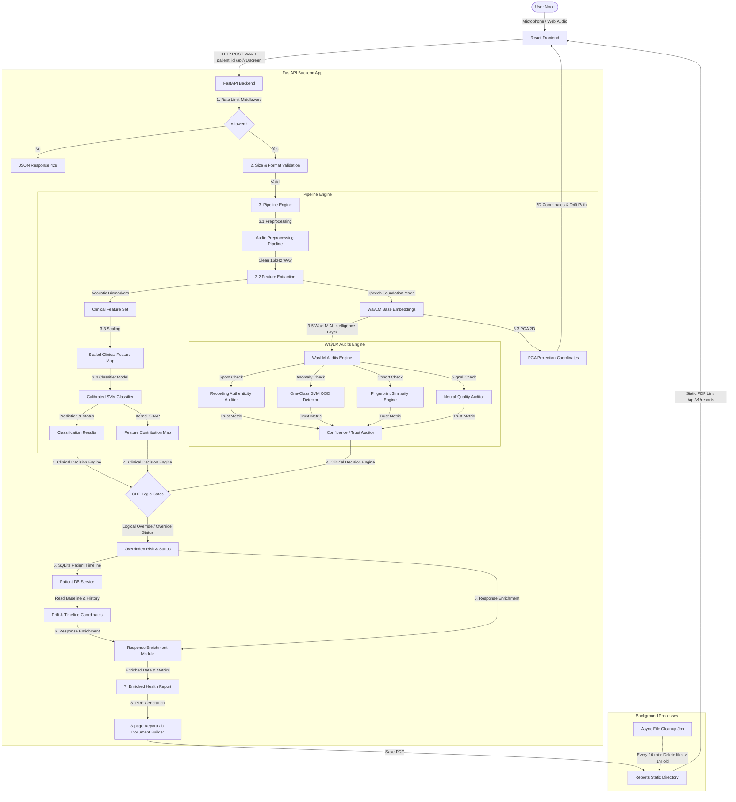

# VitaVoice System Architecture

This document outlines the technical architecture, data processing pipelines, and system layout of the **VitaVoice AI-Powered Vocal Biomarker Screening Platform**.

---

## 1. System Overview

VitaVoice is split into an enterprise-grade **FastAPI Backend** and a modern **React SPA Frontend (Vite + TypeScript)**. It features two primary screening modalities: Vocal Biomarker Analysis and Kinematic Handwriting Analysis.

### Core System Architecture

---

## 2. Audio Processing & Quality Pipeline

The backend implements a multi-stage pipeline utilizing `librosa`, `soundfile`, and `transformers` to isolate the voice signal, analyze quality, and extract clinical metrics:

### 2.1 Pre-Inference Recording Quality Analysis
Before passing raw audio to the machine learning model, a dedicated **Recording Quality Analyzer** runs to check signal integrity:
- **Background Noise & SNR Estimation**: Computes RMS energy of audio frames using 25ms windows with 10ms hops. Identifies noise floors and computes the Signal-to-Noise Ratio (SNR) in dB.
- **Speech Coverage & Silence Ratio**: Uses adaptive thresholding based on the noise floor to distinguish speech from silent frames, calculating speech coverage and silence ratios.
- **Clipping Detection**: Checks if the audio waveform reaches digital saturation limits (amplitude $\ge 0.99$), warning if microphone clipping occurs.
- **Microphone Status & Suitability**: Labels the input signal quality (e.g., "Good", "Noisy", "Clipping Detected", "No Signal") and assigns a 1-5 star score. Screenings with scores $\le 2$ display warning notices about potential reliability issues.

### 2.2 Audio Preprocessing
1. **Downsampling & Resampling**: Forces raw input audio to mono channel at `16,000 Hz` (the standard sample rate for deep neural speech models).
2. **Spectral Gating Noise Reduction**: Estimates background noise profile and gates low-amplitude noise frequencies to isolate pure vocal cord signals.
3. **Longest-Run VAD Segmenter**: Detects voiced frames using energy and spectral flatness thresholds, then extracts the longest continuous voiced segment from the original waveform. This avoids phase discontinuities and frame overlap concatenation artifacts, keeping pitch stability metrics (Jitter/Shimmer) clean.
4. **Loudness Normalization**: Standardizes signal amplitude to a target peak of `-1.0 dBFS` to prevent microphone volume differences from biasing the classification.

---

## 3. Machine Learning & Independent AI Verification Layer

To prevent Out-Of-Distribution (OOD) neural embeddings from corrupting clinical predictions and to ensure explainable audit trails, the system implements a completely decoupled design. Raw acoustic classification is performed by a calibrated SVM, while the **WavLM Base Neural Model** acts as an independent AI Intelligence Layer:

### 3.1 WavLM AI Intelligence Audits
- **Fingerprint & Similarity Engine**: Passes the mean-pooled 768-D speaker vector through cosine and Mahalanobis distance metrics against clinical target cohorts. A $k$-nearest neighbors (KNN) classification is run on the visual cluster coordinates to trace close cohort neighbors.
- **Recording Authenticity & Spoof Auditor**: Inspects the recording for robotic/synthetic speech patterns, audio compression codecs, and playback loopback attacks by evaluating:
  - Spectral Flatness standard deviation (to flag unnatural frequency flatness).
  - Robotic Pitch Monotonicity (F0 variance over speech segments).
  - Saturation Clipping Ratio.
- **Out-of-Distribution (OOD) Detector**: Employs a One-Class SVM boundary in WavLM space. Distances outside the normal healthy/Parkinson's voice distributions flag OOD recordings (e.g. coughs, ambient noise, non-human sounds).
- **Neural Quality Auditor**: Cross-references SNR levels, background noise profiles, and speech segment coverage thresholds against reference quality distributions.
- **Confidence & Trust Auditor**: Calibrates an overall Trust Level (High, Medium, Low) by fusing classifier probability margins, OOD boundaries, spoof risk metrics, and database-tracked timeline variance.

### 3.2 Clinical Decision Engine (CDE) Logic Gates
The CDE acts as a logical gatekeeping layer that overrides forced SVM risk categories to prevent diagnostic mistakes:
- **Rule 1.1 (Severe Poor Quality)**: If overall quality score is $\le 1.5$ stars, set status to `2` (Suspended) and request re-recording.
- **Rule 1.2 (Severe Out-of-Distribution)**: If the voice sample is out-of-distribution, override classification status to `1` (Inconclusive) and label the result as OOD.
- **Rule 1.3 (Authenticity Violation)**: If spoofing/replay attack is detected, suspend the screening process immediately.
- **Rule 1.4 (Borderline High Variance)**: If the classifier prediction lies near the decision boundary and the trust score is low, override the category to "Inconclusive - High Variance".

---

## 4. SQLite Patient Timeline & Longitudinal Drift

The backend integrates an enterprise SQLite patient service to track longitudinal voice trajectories:
- **Timeline SQLite Database (`PatientDBService`)**: Stores patient credentials, session IDs, timestamps, raw acoustic scores, decision reasons, and the compressed 2D coordinates.
- **Voice Baseline Calibration**: Automatically identifies the patient's initial screening as their "acoustic baseline."
- **Voice Drift Vector Trajectory**: Computes the Euclidean distance and angle between the patient's current coordinate and their baseline embedding. If a patient's voice coordinate drifts significantly towards the pathology reference cluster across sessions, it flags a progressive vocal instability trend.
- **Frontend Trajectory Mapping**: The UI query hook fetches the timeline array and dynamically draws a chronological vector path linking coordinate history on the latent space chart.

---

## 5. Handwriting Kinematics Pipeline

For handwriting analysis, the frontend canvas captures user-drawn spiral and wave patterns, exporting them as base64 images. The backend (`/api/v1/handwriting/predict` or similar) processes these through a dual-CNN pipeline:
- **Image Preprocessing**: Grayscale conversion, resizing to 224x224, and ImageNet normalization.
- **Dual ResNet18 Models**: Two separate ResNet18 CNNs (with fine-tuned layer 4 and custom classification heads) analyze the spiral and wave drawings independently.
- **Fusion Meta-Model**: A Logistic Regression meta-model fuses the scalar probability outputs from the two CNNs to yield a final confidence score for Parkinson's risk.

---

## 6. Response Enrichment & Clinical Reports

Once the CDE gates and DB timeline operations are complete, the **Response Enrichment Module** compiles annotations:
- **Certainty Calibration**: Translates raw risk margins into confidence labels ("Very High", "High", "Moderate", "Low") and prediction reliability ratings.
- **Top Biomarkers Extraction**: Automatically maps mathematical SHAP values to positive/negative directional indicators (e.g., $\uparrow$ Jitter, $\downarrow$ HNR) with human-readable clinical explanations.
- **Responsible AI Guardrails**: Adds explicit disclaimers regarding pre-clinical screening boundaries.
- **PDF Report Generation**: Invokes a custom ReportLab builder to compile a 3-page clinical-grade report containing the patient timeline trend, acoustic quality verification table, SHAP attributions, recommendations, and baseline drift.

## 7. Clinical Copilot & Fallback Architecture

To support clinicians with deeper diagnostic context, the backend defines a modular **Clinical Copilot** sub-system via analysis router hooks (`/api/v1/analysis`):
- **Clinical Copilot Insights (`/api/v1/analysis/copilot-insight`)**: Processes voice recording IDs to serve LLM-ready context. The baseline fallback engine provides structured rule-based summaries derived from acoustic DSP measurements. The interface is pre-built to support future Retrieval-Augmented Generation (RAG) by integrating ChromaDB vector stores and external LLM APIs (e.g., OpenAI, Ollama).
- **Direct Report Access (`/api/v1/analysis/download-pdf/{prediction_id}`)**: Direct FileResponse stream for generating and downloading the compiled clinical ReportLab PDF document from server cache.

---

## 8. Frontend Component Architecture

The React frontend handles real-time audio visualization, environment calibration, and results dashboards:

- **Acoustic Calibration Node**: Samples ambient noise for 2 seconds to establish an RMS baseline before allowing recording.
- **Real-time Sinusoidal Wave Visualizer**: Renders overlapping sine waves using HTML5 Canvas API in a 60fps animation loop driven by the Web Audio API time-domain node.
- **Microphone Level Meter**: Displays live volume (dB) and turns red if digital clipping or saturation is imminent.
- **2D UMAP/PCA Projections**: Plots the user's vocal coordinate relative to healthy and pathological reference cohorts in a custom canvas chart supporting zoom and mouse hover tooltips.
- **Timeline Sidebar**: Loads and stores the user's last 10 screening records in `localStorage` for visual comparison over time.
- **Vocal Quality & Screening Insights**: Displays the enriched response data including quality star rating, clinical status benchmarks, SHAP directional items, and natural-language explanations.
